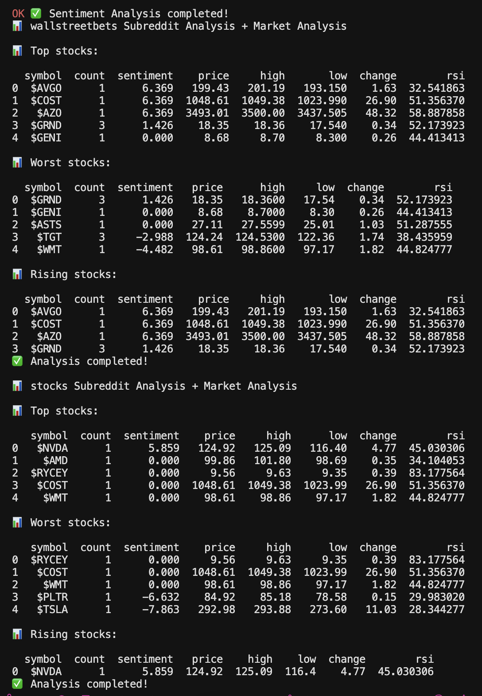

#  
**Backend for TradeSenseAI – AI-Powered market analyst*  

<a href="https://trade-sense-ai-sigma.vercel.app">Check Out The Website TradeSenseAI So Far Here
 
 

</a>

## Altharion Engine: Mining Reddit for Financial Trends
**Description**:  
The Altharion Engine's first version √A v1.0 specializes in analyzing financial, stock, and crypto-related subreddits to uncover the best, worst, and most trending stocks. By diving into the conversations and sentiment of these communities, it identifies stock discussions that are gaining traction and feeds them into market analyzers for detailed financial data such as price, high, low, and RSI. With a focus on the power of Reddit’s financial chatter. Altharion also summarizes all of the data using GPT so you can focus on whats important. Altharion delivers insightful stock recommendations based on real-world community sentiment. It’s the ultimate tool to track and capitalize on the pulse of online financial discussions.

* Test run table from model √A v1.0 (formatted)

## 🔥 Features  
✅ **Financial Data Integration** – Fetches stock prices, trading volume, and technical indicators using APIs like Yahoo Finance.
✅ **Social Sentiment Analysis** – Analyzes real-time market sentiment using social media platforms like Reddit.
✅ **AI-Driven Predictions** – Combines financial & sentiment data to generate stock trend forecasts using AI.  
✅ **REST API** – Provides structured endpoints for stock insights, predictions, and trend analysis giving users a complete analysis on the stock.

## 🏗️ Tech Stack  
- **Backend:** Python, Flask, Jupyter Notebook, Pytest, Pandas, vaderSentiment, regex
- **Machine Learning:** Pandas, Numpy, OpenAI GPT API, Tensorflow (comming soon)
- **APIs Used:** Yahoo Finance API (yfinance), Reddit API (praw)
- **Hosting:** Heroku

## 🔮 Coming Soon: Version 2.0  
The first release will be a **simplified LLM-powered system** that combines GPT-based insights with real-time stock and sentiment data. This version will:  
✅ Fetch stock market data & sentiment trends from APIs  
✅ Generate AI-driven stock predictions using OpenAI’s GPT  
✅ Provide a RESTful API for frontend integration  

Stay tuned for more updates! 🚀📈
