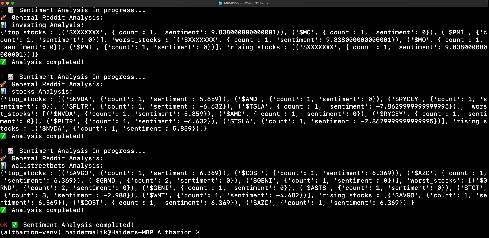

#  
**Backend for TradeSenseAI – AI-Powered market analyst*  

<a href="https://trade-sense-ai-sigma.vercel.app">Check Out The Website TradeSenseAI So Far Here
 
 

</a>

## Current Version √A is the first version of the Altharion engine, so far the reddit analysis has been completed, it can anylize any subreddit and output the best, worst and trending stocks from the subreddit. Soon i will add the technical side of things with yf finance and AlphaVantage etc. The first version while humble is sure to deliver unique and amazing stock recomendations.
test run of the reddit analysis:

## 📌 Overview  
Altharion is the backend system powering TradeSenseAI, a hybrid stock prediction tool that leverages financial data, social sentiment analysis, and AI-driven insights. Built using **Flask**, it serves as the core data processing and machine learning engine, handling API integrations, sentiment analysis, and stock market predictions.  

## 🔥 Features  
✅ **Financial Data Integration** – Fetches stock prices, trading volume, and technical indicators using APIs like Yahoo Finance, Alpha Vantage, and IEX Cloud.  
✅ **Social Sentiment Analysis** – Analyzes Twitter, Reddit, and Google Trends for real-time market sentiment.  
✅ **AI-Driven Predictions** – Combines financial & sentiment data to generate stock trend forecasts using machine learning models.  
✅ **REST API** – Provides structured endpoints for stock insights, predictions, and trend analysis.  

## 🏗️ Tech Stack  
- **Backend:** Flask, Python, Jupyter Notebook, Pytest
- **Machine Learning:** scikit-learn, TensorFlow, Pandas, Numpy, OpenCV, Pytorch, OpenAI GPT API
- **Databases:** Firebase
- **APIs Used:** Yahoo Finance API, IEX Cloud, Alpha Vantage, Twitter/X API, Reddit API, Google Trends API
- **Hosting:** Heroku

## 🔮 Coming Soon: Version 1.0  
The first release will be a **simplified LLM-powered system** that combines GPT-based insights with real-time stock data. This version will:  
✅ Fetch stock market data & trends from APIs  
✅ Generate AI-driven stock predictions using OpenAI’s GPT  
✅ Provide a RESTful API for frontend integration  

Stay tuned for more updates! 🚀📈
