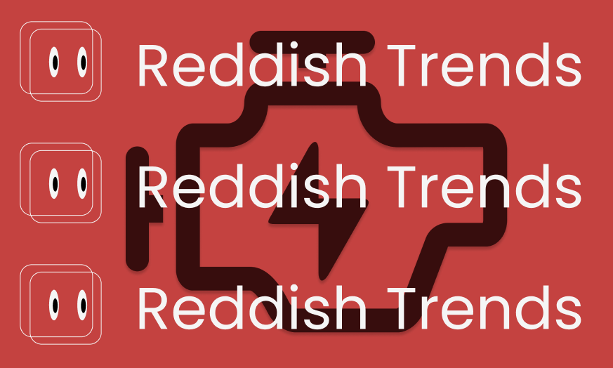

# Reddish Trends Engine — backend of Reddish Trends



# 

This README documents the engine that powers the Reddish Trends website. It focuses on:
- Reddit fetching & preprocessing
- Sentiment extraction
- Market enrichment (yfinance)
- The explainable 3-step ranking algorithm (data_processing.py)
- API endpoints and scheduling (main.py)

Quick overview
- Purpose: turn Reddit conversation into ranked, explainable stock signals enriched with market data.
- Primary language: Python
- Main modules:
  - sentiment_analysis.py — fetch + preprocess Reddit posts + VADER sentiment + ticker extraction
  - market_analysis.py — yfinance enrichment (price, high, low, RSI, percent change)
  - data_processing.py — deterministic 3‑step ranking (Top/Worst/Rising)
  - market_sentiment_analysis.py — orchestration + parallelization
  - main.py — Flask API, caching and APScheduler cron jobs
  - gpt_processing.py — optional GPT JSON summarization for headline stocks

Core pipeline (high level)
1. Fetch posts and top-level comments from target subreddits and build a "full_text" blob per post.
2. Extract tickers using regex r"\$[A-Z]+" and compute compound sentiment (VADER) per post.
3. Aggregate mentions & average sentiment per ticker across posts.
4. Enrich each ticker using yfinance (price, range, RSI, etc).
5. Run the 3-step ranking algorithm to produce Top, Worst and Rising stocks.
6. Optionally call GPT to produce a concise JSON analysis for each headline stock.
7. Cache results to cached_analysis.json and expose via API endpoints.

Reddit fetching & preprocessing (implementation notes)
- Fetch behavior (sentiment_analysis.py):
  - Retrieve `limit` submissions for each subreddit and `post_type` (hot/new/top/rising/controversial).
  - For "top" & "controversial", optionally pass a time_filter (hour/day/week/month/year/all).
  - Load top-level comments only via submission.comments.replace_more(limit=0).
  - Limit comments per post to `comment_limit` to keep latency predictable.
  - Build `full_text` = "Post Title: ... Post Text: ... Top Comments: ..." and run VADER on that blob.
  - Extract tickers using r"\$[A-Z]+" and aggregate counts + sentiment scores.
- Why this design:
  - Bounded comment retrieval = predictable runtime.
  - Title + body + top comments = useful context, lower noise vs deep-comment traversal.
  - Direct mapping ticker → example post yields explainability for UX.

Market enrichment (market_analysis.py)
- Uses yfinance to download historical data for requested period (1d, 5d, 1mo, 3mo, 6mo, 1y, etc).
- Computes:
  - current price, high, low
  - absolute change and percentage change vs period-open
  - RSI (14-period) when enough data exists
- get_stock_data(symbol, period) returns a uniform dict or an error message when data is missing/delisted.

The ranking algorithm (data_processing.py) — explainable 3-step filter
1. Per-subreddit peak selection:
   - For each subreddit, pick the stock(s) that have the highest sentiment (or lowest for worst).
2. Cross-subreddit frequency:
   - Select stocks that reappear across multiple subreddits' peak lists — frequency across communities is rewarded.
3. Subreddit mention weight:
   - If symbols tie on frequency, break ties using the mention count (how many times it was mentioned in the subreddit where it was strongest).
- Result: repeat, cross-community traction outranks one-off spikes (explainable and reproducible).

API endpoints (main.py)
- POST /api/home
  - request.type == "getgeneralanalysis"
    - Returns cached analysis if present and fresh (<24h) otherwise triggers fresh analysis.
  - request.type == "redogeneralanalysis"
    - Force a fresh analysis and update cache (saved to cached_analysis.json).
- POST /api/playground
  - request.type == "getplaygroundgeneralanalysis"
    - Run general analysis with custom parameters (subreddits, limit, comment_limit, sort, time, period).
  - request.type == "getplaygroundspecificanalysis"
    - Run specific-stock analysis with custom parameters (subreddits, stocks, etc).
- Notes:
  - API validates origin and referer headers (configured for https://www.reddishtrends.com).
  - Playground endpoints do not write to the global cache.

Scheduler & caching
- Cached file: `cached_analysis.json`.
- APScheduler jobs:
  - Cron job: daily at 12:00 PM US/Eastern → scheduled_analysis() → perform_general_analysis().
  - Interval fallback: every 24 hours to guarantee at least one run per day.
  - Startup job checks cache age and triggers update if outdated.
- Cached responses include "last_updated" timestamp.

Quick examples

Call the engine API (curl)
```bash
curl -X POST http://localhost:5000/api/home \
  -H "Content-Type: application/json" \
  -d '{"request":{"type":"getgeneralanalysis"}}'
```

Playground example (Python)
```python
import requests
payload = {
  "request": {
    "type":"getplaygroundgeneralanalysis",
    "parameters": {
      "subreddits":["wallstreetbets","stocks"],
      "limit":20,
      "comment_limit":5,
      "sort":"hot",
      "time":None,
      "period":"1mo"
    }
  }
}
r = requests.post("http://localhost:5000/api/playground", json=payload)
print(r.json())
```

Internal usage (engine dev)
```python
from market_sentiment_analysis import run_general_analysis
from data_processing import get_top_stock, get_worst_stock, get_rising_stock

analysis = run_general_analysis(["wallstreetbets","stocks"], limit=10)
top = get_top_stock(analysis)
worst = get_worst_stock(analysis)
rising = get_rising_stock(analysis, limit=3)
```

Sample Top_Stock output (abbreviated)
```json
{
  "symbol":"$SPY",
  "company_name":"SPDR S&P 500 ETF Trust",
  "count":3,
  "sentiment":8.71,
  "price":576.68,
  "percentage_change":-1.21,
  "rsi":28.53,
  "GPT_Analysis":{"overview":"...","prediction":"...","Confidence Score":78}
}
```

Operational tips
- Put API keys and secrets in a .env file (do not commit).
- Rate-limit protections: keep `limit` and `comment_limit` reasonable for production to avoid API caps.
- Add unit tests around data_processing.py for tie-breaks and edge cases (delisted symbols, missing data).

#

<p align="center">
    
</p>

<p align="center">
    <strong>Reddish Trends</strong> — Haider Malik<br/>
    &copy; 2025 Haider Malik. All rights reserved.
</p>
